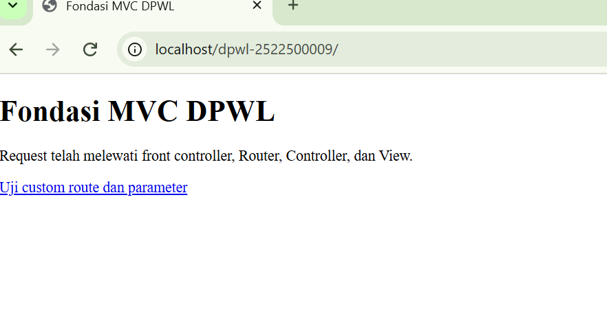
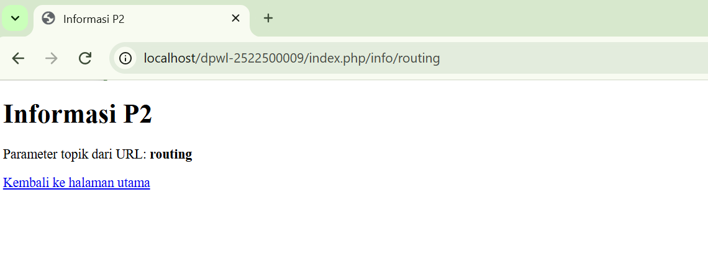
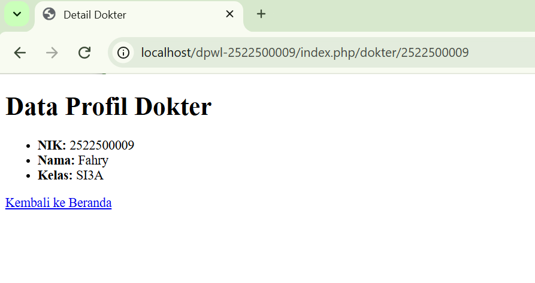

# pertemuan-02
## 1. Tujuan Praktikum
[Jelaskan tujuan P2 dengan kalimat sendiri.]
Tujuan P2 adalah membangun dan memahami struktur dasar aplikasi PHP berbasis MVC, terutama bagaimana request dari pengguna diproses mulai dari index.php sebagai satu titik masuk, kemudian diteruskan melalui Router dan Controller hingga menghasilkan tampilan melalui View.
## 2. Struktur Direktori
## jawaban 2. Struktur Direktori
```text
pertemuan-02/
├── application/
│   ├── config/
│   │   ├── config.php      -> Mengatur konfigurasi dasar aplikasi (Base URL, dll)
│   │   └── routes.php      -> Mengatur pemetaan rute URL ke Controller
│   ├── controllers/
│   │   └── Home.php        -> Controller utama untuk menangani logika request
│   ├── helpers/
│   │   └── url_helper.php  -> Menyediakan fungsi bantuan base_url() dan site_url()
│   └── views/
│       └── home/
│           ├── index.php   -> View untuk halaman utama (beranda)
│           ├── info.php    -> View untuk menampilkan informasi routing
│           └── dokter.php -> View kustom untuk profil dokter
├── assets/
│   └── css/
│       └── app.css         -> File stylesheet aset statis
├── system/                  -> Core framework MVC
└── index.php               -> Front Controller (pintu masuk utama aplikasi)
```
## 3. Front controller
[Jelaskan peran index.php sebagai satu titik masuk aplikasi.]
index.php berperan sebagai satu titik masuk (single entry point) dalam aplikasi PHP. Semua permintaan dari pengguna diarahkan terlebih dahulu ke file ini sebelum diteruskan ke bagian aplikasi yang sesuai.
## 4. Routing dan Pemetaan URL
| URL/Route | Controller | Method | Parameter | View |
|---|---|---|---|---|
| / | Home | index | - | home/index.php |
| home/index | Home | index | - | home/index.php |
| home/info/mvc | Home | info | mvc | home/info.php |
| info/routing | Home | info | routing | home/info.php |
| dokter/(:num) | Home | Mahasiswa | $1 | Home/mahasiswa.php |
## 5. Base URL dan Helper
Jelaskan fungsi base_url() dan site_url(), kemudian berikan contoh penggunaannya pada implementasi P2: 
- base_url() untuk memanggil assets/css/app.css; 
- site_url() untuk membentuk URL navigasi/route aplikasi.
Dalam CodeIgniter, base_url() dan site_url() sama-sama digunakan untuk membentuk URL, tetapi memiliki fungsi yang berbeda.

base_url() digunakan untuk mengacu pada alamat dasar aplikasi, biasanya untuk file statis seperti CSS, JavaScript, gambar, dan assets lainnya.

site_url() digunakan untuk membentuk URL menuju route/halaman aplikasi, sehingga cocok untuk navigasi ke controller atau method tertentu.
## 6. Alur Request-response
Jelaskan dua alur berikut:
1. Alur eksekusi aktual P2:
Browser → index.php → Router → Controller → View → Response.
2. Posisi Model dalam arsitektur MVC lengkap:
Browser → index.php → Router → Controller → Model → basis data/data → Model → Controller → View → 
Response.
Pada implementasi P2, Model belum digunakan karena akses dan pengelolaan basis data mulai 
diimplementasikan pada P3.

Browser → index.php → Router → Controller → View → Response

Penjelasannya:

Browser mengirim request ketika pengguna membuka URL aplikasi.

index.php menjadi satu titik masuk yang menerima request.

Router menentukan route atau controller yang sesuai berdasarkan request.

Controller memproses request dan menentukan tampilan yang harus diberikan.

View menghasilkan tampilan halaman kepada pengguna.

Response dikirim kembali ke browser untuk ditampilkan.

Pada tahap P2, proses tersebut belum melibatkan Model atau basis data.
## 7. Hasil Pengujian dan Debugging
Catat skenario pengujian valid dan tidak valid beserta hasilnya. Jika ditemukan kesalahan selama 
implementasi, dokumentasikan sekurang-kurangnya satu proses debugging yang memuat:
Gejala → Penyebab → Perbaikan → Hasil Uji Ulang
Jika seluruh implementasi langsung berjalan sesuai hasil yang diharapkan, jelaskan hasil pemeriksaan 
sintaks dan pengujian yang telah dilakukan.

Karena tidak ditemukan kesalahan selama implementasi, tidak ada proses debugging khusus yang perlu didokumentasikan.

Pemeriksaan sintaks dilakukan pada file PHP yang digunakan dalam P2. Hasil pemeriksaan menunjukkan bahwa tidak terdapat kesalahan sintaks (syntax error). Struktur kode dapat dijalankan oleh PHP tanpa menghasilkan error sintaks.
## 8. Bukti Tangkapan Layar
Sisipkan gambar yang relevan dari folder dokumentasi/ dengan perintah:
### Gambar 1. Hasil Pengujian Halaman Utama 
 
### Gambar 2. Hasil Pengujian Custom Route 

### Gambar 2. Profin Dokter

## 9. Kesimpulan P2
ngka MVC daJelaskan apa yang sudah dapat dilakukan keran apa yang baru akan ditambahkan pada P3.